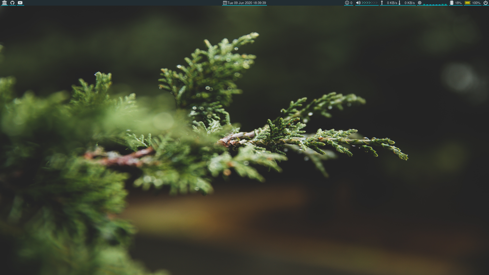
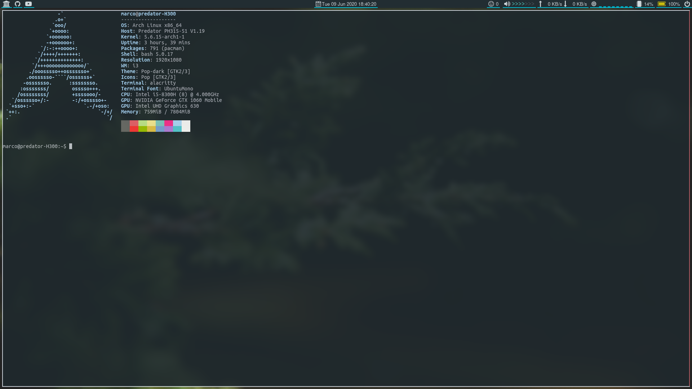
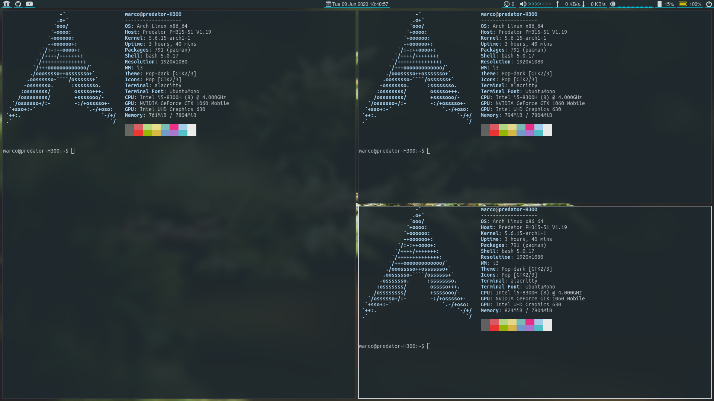
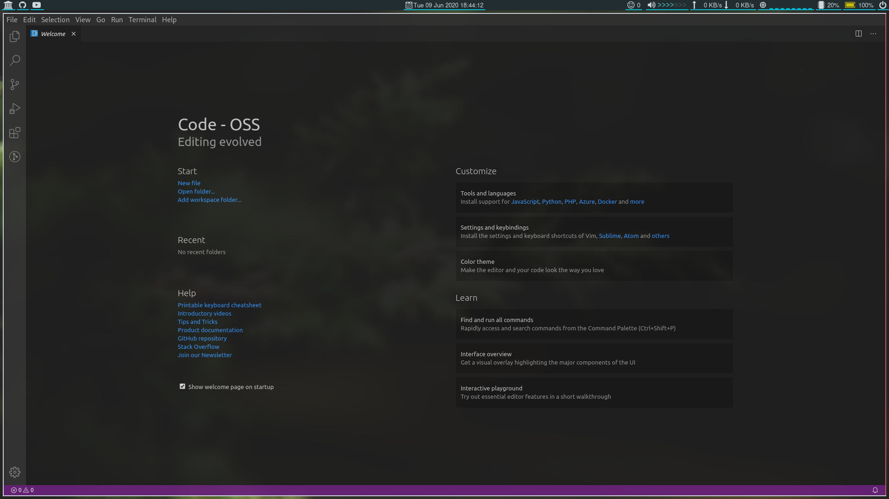
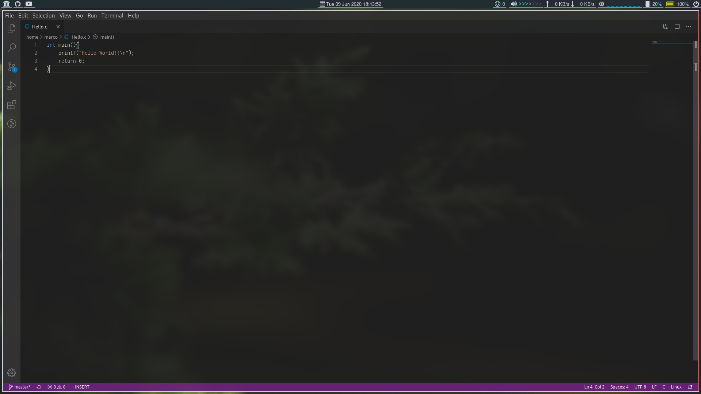

# Config files for my i3-gaps

These files are taken from other github repos and changed to fit my preferences. 

## **Note**: I do not take any credit in the making of these files:

- [**Adapta-Polybar**](https://github.com/matoruru/polybar-adapta-theme)
- [**i3-gaps and i3status configs**](https://github.com/addy-dclxvi/i3-starterpack)
- [**SimplecOne**](https://github.com/luizfnunes/SimpleC-one-Conky)

- **Pictures:** these are wallpapers from various distros such as: 
    - [**Pop!-OS**](https://pop.system76.com/)
    - [**Deepin**](https://www.deepin.org/en/download/)
    - [**Ubuntu**](https://ubuntu.com/)
    - [**ElementaryOS**](https://elementary.io/en/)

## The rest are files I created myself:

- **gpuswitch:** These are simple scripts for gpu switching on fedora (which I don't use anymore).
- **bashrc:** Bash file with my configs not much to explain here.
- **vimrc:** Same as bashrc but for vim.
- **compton:** Just adds blur to alacritty, vscode and clion.
- **monitors.sh** Script to detect if the external monitor is connected and disable the laptop monitor acordingly.

## Some screenshots:

### Empty workspace:

### 1 terminal open:

### 3 terminal open:

### Code-OSS start:

### Code-OSS Hello World!!:

